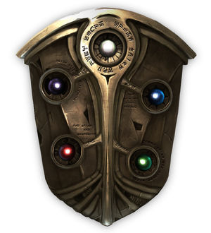

# recordName

> This is the feed's ID which can be letters, numbers, or dashes. Spaces are not allowed. Maximum length is 15 characters.

feeventsjp

# displayName

> This is the title of the custom feed. Maximum length is 24 characters.

ファイアーエムブレム同人イベント情報・改

# description

> This is the description of the feed.

ファイアーエムブレムの同人イベントに関するキーワードを拾います。【現在の設定：刻印の誇り/黎明の星の下にて/5年目の同窓会（略称は拾いません）】WEBオンリーの追加情報お待ちしております。

# searchTerms

> There are three types of search terms:
>
> - Keywords: Test these in [https://bsky.app/search](https://bsky.app/search). `AND` is implicit, so `cat dog` on one line will require both `cat` and `dog`. You can use quotes as well `"hot dog"`.
> - Users: links such as `https://bsky.app/profile/why.bsky.team` will pull in the user's posts. To include replies and reposts, you can add the following flags: `https://bsky.app/profile/why.bsky.team +replies +reposts`.
> - Pinned posts: links such as `https://bsky.app/profile/saddymayo.bsky.social/post/3jxju2wwap22e` will pin at the top of the feed. One link per line, please.

- 刻印の誇り
- 黎明の星の下にて
- 5年目の同窓会

# safeMode

> Safe mode limits the total number of API calls coming from Cloudflare.
>
> Set to `false` if you have higher limits via a paid Cloudflare plan.

true

# avatar

> This must link to an image (PNG or JPEG) in the same directory as this CONFIG.md. It doesn't have to be called `avatar.png`, but just be sure this CONFIG.md points to the correct file.

